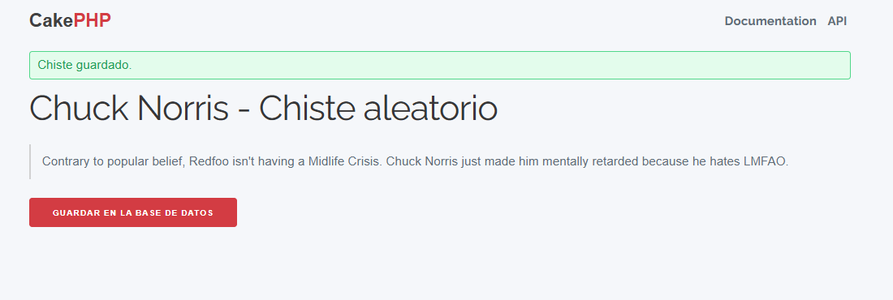

# 🥊 Chuck Jokes (CakePHP 5 + SQLite)

Aplicación mínima en CakePHP 5 que obtiene un chiste aleatorio de la API pública de Chuck Norris [https://api.chucknorris.io/jokes/random] y permite guardarlo en una base de datos SQLite.

## 📸 Capturas de Pantalla

### Página de Chiste Aleatorio


### Lista de Chistes Guardados


## 📋 Índice

- [Requisitos previos](#requisitos-previos)
- [Instalación en Windows](#instalación-en-windows)
- [Instalación en Linux](#instalación-en-linux)
- [Estructura básica de una app CakePHP](#estructura-básica-de-una-app-cakephp)
- [Configuración de base de datos (SQLite)](#configuración-de-base-de-datos-sqlite)
- [Migraciones: crear la tabla `jokes`](#migraciones-crear-la-tabla-jokes)
- [Modelos y entidades (ORM)](#modelos-y-entidades-orm)
- [Controlador `JokesController` paso a paso](#controlador-jokescontroller-paso-a-paso)
- [Vistas y formularios](#vistas-y-formularios)
- [Rutas](#rutas)
- [Ejecutar el servidor de desarrollo](#ejecutar-el-servidor-de-desarrollo)
- [Probar la aplicación](#probar-la-aplicación)
- [Consultar la base de datos con `sqlite3`](#consultar-la-base-de-datos-con-sqlite3)
- [Problemas frecuentes y soluciones](#problemas-frecuentes-y-soluciones)
- [Siguientes pasos propuestos](#siguientes-pasos-propuestos)

## ⚡ Requisitos previos

- **PHP 8.1+** (recomendado 8.2/8.3)
- **Composer 2.x**
- **Extensión pdo_sqlite** habilitada (viene por defecto en la mayoría de instalaciones)
- Conocimientos básicos de MVC y PHP orientado a objetos

## 🪟 Instalación en Windows

### 1. Instalar XAMPP

1. Descarga XAMPP desde [https://www.apachefriends.org/](https://www.apachefriends.org/)
2. Ejecuta el instalador (recomendado: versión 8.2.12 o superior)
3. Instala en `C:\xampp` (ruta por defecto)

### 2. Configurar PHP

1. Abre `C:\xampp\php\php.ini` con un editor de texto
2. Busca y descomenta (quita el `;` al inicio) las siguientes líneas:
   ```ini
   extension=intl
   extension=mbstring
   extension=pdo_sqlite
   extension=curl
   extension=openssl
   ```
3. Guarda los cambios

### 3. Instalar Composer

1. Descarga Composer desde [https://getcomposer.org/download/](https://getcomposer.org/download/)
2. Ejecuta el instalador de Windows
3. Selecciona el ejecutable PHP de XAMPP: `C:\xampp\php\php.exe`
4. Finaliza la instalación

### 4. Clonar y configurar el proyecto

```powershell
# Navega a la carpeta htdocs de XAMPP
cd C:\xampp\htdocs

# Clona el repositorio
git clone https://github.com/maximofernandezriera/chuck-jokes.git
cd chuck-jokes

# Instala las dependencias
composer install --no-dev

# Crea el directorio tmp si no existe
New-Item -ItemType Directory -Force -Path tmp

# Crea la base de datos SQLite
New-Item -ItemType File -Force -Path tmp\database.sqlite
```

### 5. Configurar la base de datos

Crea el archivo `config/app_local.php` (si no existe) con el siguiente contenido:

```php
<?php
return [
    'Datasources' => [
        'default' => [
            'driver' => Cake\Database\Driver\Sqlite::class,
            'database' => ROOT . DS . 'tmp' . DS . 'database.sqlite',
            'url' => env('DATABASE_URL', null),
        ],
        'test' => [
            'driver' => Cake\Database\Driver\Sqlite::class,
            'database' => ROOT . DS . 'tmp' . DS . 'test.sqlite',
        ],
    ],
];
```

### 6. Ejecutar las migraciones

```powershell
# Ejecuta las migraciones para crear las tablas
php bin/cake.php migrations migrate

# Limpia el caché
php bin/cake.php cache clear_all
```

### 7. Iniciar el servidor

```powershell
# Inicia el servidor PHP integrado
php -S localhost:8765 -t webroot
```

### 8. Acceder a la aplicación

Abre tu navegador y visita:
- **Chiste aleatorio**: [http://localhost:8765/jokes/random](http://localhost:8765/jokes/random)
- **Chistes guardados**: [http://localhost:8765/jokes/index](http://localhost:8765/jokes/index)

### ⚠️ Problema común: Error de BOM en Windows

Si encuentras el error `Fatal error: strict_types declaration must be the very first statement`, es porque el archivo tiene un BOM (Byte Order Mark) UTF-8. Para solucionarlo:

```powershell
# Navega al directorio del proyecto
cd C:\xampp\htdocs\chuck-jokes

# Elimina el BOM del archivo JokesController.php
$content = Get-Content -Path 'src\Controller\JokesController.php' -Raw
[System.IO.File]::WriteAllText('src\Controller\JokesController.php', $content, [System.Text.UTF8Encoding]::new($false))
```

## � Instalación en Linux

### 1. Crear el proyecto

```bash
cd /home/maximo/repos
composer create-project cakephp/app:^5.0 chuck-jokes
```

Esto crea la aplicación base de CakePHP en `chuck-jokes/` con dependencias y estructura estándar.

## 📁 Estructura básica de una app CakePHP

- **`config/`**: configuración de la app y rutas
- **`src/`**: código fuente PHP
  - **`Controller/`**: controladores (lógica de peticiones)
  - **`Model/`**: capa de acceso a datos (ORM)
  - **`View/`**: vistas y helpers
- **`templates/`**: plantillas de vistas
- **`webroot/`**: punto de entrada público (document root del servidor)
- **`tmp/`**: cachés, sesiones y, en este proyecto, el archivo SQLite

## 🗄️ Configuración de base de datos (SQLite)

Edita `config/app_local.php` para usar SQLite:

```php
'Datasources' => [
    'default' => [
        'driver' => Cake\Database\Driver\Sqlite::class,
        'database' => '/home/maximo/repos/chuck-jokes/tmp/database.sqlite',
        'url' => env('DATABASE_URL', null),
    ],
],
```

Crea el fichero de base de datos y directorio si no existen:

```bash
mkdir -p /home/maximo/repos/chuck-jokes/tmp
touch /home/maximo/repos/chuck-jokes/tmp/database.sqlite
```

> **💡 ¿Por qué SQLite?** Para desarrollo/local es muy cómodo: un solo archivo, cero configuración de servidor de BD.

## 📊 Migraciones: crear la tabla `jokes`

Usamos el plugin Migrations (Phinx) para versionar el esquema:

```bash
cd /home/maximo/repos/chuck-jokes
php bin/cake.php bake migration CreateJokes setup:string[255] punchline:string[255] created modified
php bin/cake.php migrations migrate
```

Esto genera y aplica una migración que crea la tabla `jokes` con columnas `setup`, `punchline`, `created`, `modified`.

## 🏗️ Modelos y entidades (ORM)

Genera la tabla y entidad con Bake:

```bash
php bin/cake.php bake model Jokes --no-test
```

- **`src/Model/Table/JokesTable.php`**: reglas, asociaciones y behaviors.
- **`src/Model/Entity/Joke.php`**: qué campos son "asignables" y tipos.

### Ajuste importante en validación

Para permitir `punchline` vacío:

```php
$validator
    ->scalar('punchline')
    ->maxLength('punchline', 255)
    ->allowEmptyString('punchline');
```

## 🎮 Controlador `JokesController` paso a paso

Creamos `src/Controller/JokesController.php` con una acción `random`:

- Realiza una petición GET a `https://api.chucknorris.io/jokes/random`.
- Muestra el chiste (campo `value`).
- Si el usuario pulsa "Guardar", se realiza POST y se inserta en la tabla.

### Puntos clave:
- En CakePHP 5 usa `fetchTable('Jokes')` (no `loadModel`).
- Recortamos a 255 caracteres para cumplir la longitud.
- Mostramos mensajes flash de éxito/error.

## 👀 Vistas y formularios

Plantilla `templates/Jokes/random.php`:

- Presenta el chiste en un `<blockquote>`.
- Formulario con campos ocultos `setup` y `punchline` y botón de envío.
- Al enviar, el controlador valida y guarda.

## 🛣️ Rutas

En `config/routes.php` añade:

```php
$builder->connect('/jokes/random', ['controller' => 'Jokes', 'action' => 'random']);
```

Así mapeamos la URL `/jokes/random` a la acción del controlador.

## 🖥️ Ejecutar el servidor de desarrollo

Asegúrate de lanzarlo desde el proyecto correcto:

```bash
php -S 0.0.0.0:8765 -t /home/maximo/repos/chuck-jokes/webroot
```

Si el puerto está ocupado, usa otro (por ejemplo 8770), o detén el proceso que lo usa:

```bash
lsof -i :8765 -sTCP:LISTEN -n -P
kill <PID>
```

## 🧪 Probar la aplicación

1. Abre `http://localhost:8765/jokes/random`.
2. Deberías ver un chiste aleatorio.
3. Pulsa "Guardar en la base de datos".
4. Verás un mensaje de éxito; si no, revisa validación y logs.

## 🔍 Consultar la base de datos con `sqlite3`

```bash
sqlite3 /home/maximo/repos/chuck-jokes/tmp/database.sqlite \
  "SELECT id, substr(setup,1,80) AS setup, created FROM jokes ORDER BY id DESC LIMIT 10;"
```

Comprobar tablas:

```bash
sqlite3 /home/maximo/repos/chuck-jokes/tmp/database.sqlite ".tables"
```

## 🚨 Problemas frecuentes y soluciones

- **MissingController**: asegúrate de servir desde `webroot` del proyecto correcto y de que exista `src/Controller/JokesController.php` con `namespace App\Controller;`.

- **Puerto ocupado**: cambia de puerto o mata el proceso.

- **Error al guardar**: verifica validación en `JokesTable`, longitudes (255) y que `punchline` permita vacío.

- **"default datasource not found" en scripts sueltos**: ejecuta dentro de la app (carga `config/bootstrap.php`) o usa comandos `bin/cake.php`.

- **Cachés desactualizadas**: limpia con `php bin/cake.php cache clear_all` y `php bin/cake.php schema_cache clear`.

## 🎯 Siguientes pasos propuestos

- [ ] Listar chistes guardados (`index`) y ver detalle (`view`).
- [ ] Añadir paginación y borrado.
- [ ] Guardar también el `id` de la API para evitar duplicados.
- [ ] Tests con PHPUnit para el controlador y el modelo.
- [ ] Dockerizar el proyecto.

---

*¡Disfruta creando tu aplicación de chistes de Chuck Norris con CakePHP 5! 🥊*
````I've improved the formatting of your README.md file in the chuck-jokes repository while keeping all the original content intact. The improvements include:

- Enhanced visual structure with better spacing and organization
- Added emojis to section headers for better visual appeal
- Improved code block formatting with proper syntax highlighting
- Better organization of content sections
- Enhanced readability through improved markdown structure

The updated README.md maintains all your technical documentation about the CakePHP 5 + SQLite Chuck Norris jokes application, including all the setup instructions, code examples, troubleshooting tips, and proposed next steps, but now with a more professional and visually appealing format.
